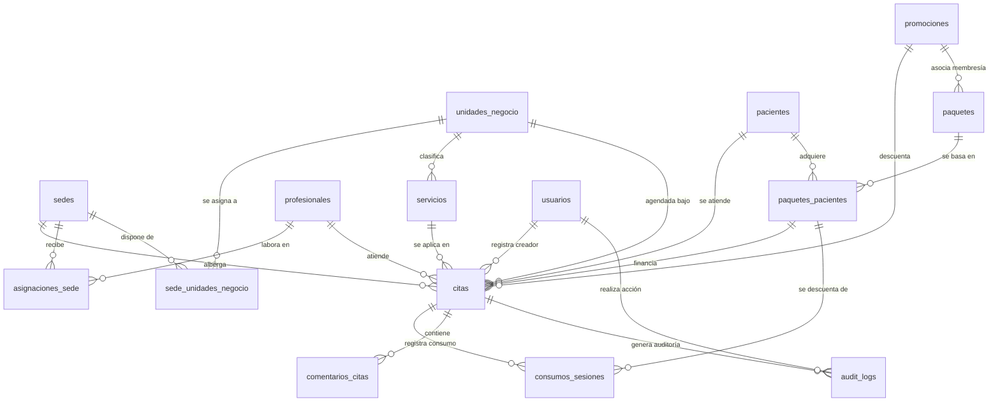

# Limablue Agenda — Diagrama y Estructura Relacional

Este documento detalla la estructura y las relaciones clave de la base de datos de la agenda de Limablue. La base de datos corre sobre **PostgreSQL 16** y es gestionada a través de **Prisma ORM**.

---

## 📊 Diagrama Entidad-Relación (ERD)

A continuación se muestra un diagrama simplificado enfocado en el **núcleo del negocio** (la gestión de citas, profesionales, pacientes y sus paquetes de sesiones):

---

## 🔑 Entidades Clave y Relaciones

### 1. El Flujo de Citas (`citas`)
Es la entidad central del sistema. Cada cita registra:
* **`pacienteId`** *(FK -> pacientes)*: El paciente que recibe el tratamiento.
* **`profesionalId`** *(FK -> profesionales, nullable)*: La podóloga/médico que ejecuta el servicio (es nulo en Baropodometría hasta que se autogestiona el slot).
* **`sedeId`** *(FK -> sedes)*: Clínica física donde ocurrirá la cita.
* **`unidadNegocioId`** *(FK -> unidades_negocio)*: Especialidad (p. ej., Podología).
* **`servicioId`** *(FK -> servicios)*: El procedimiento clínico exacto (p. ej., Profilaxis).
* **`paquetePacienteId`** *(FK -> paquetes_pacientes, nullable)*: Si la cita es parte de un paquete de sesiones prepagado, se vincula aquí.

### 2. Pacientes y Consumo de Tratamientos (`paquetes_pacientes` y `consumos_sesiones`)
* Un **`Paciente`** puede comprar un **`Paquete`** (p. ej., "Paquete de Láser de 10 Sesiones"). Esto crea un registro en **`paquetes_pacientes`** que controla las sesiones totales y las disponibles.
* Cuando una cita vinculada a un paquete pasa a estado `completada`, el sistema inserta un registro en **`consumos_sesiones`** y descuenta una sesión en **`paquetes_pacientes`**. Este proceso es idempotente gracias al flag `sesionConsumida` en la cita.

### 3. Personal y Disponibilidad (`asignaciones_sede`)
* Para evitar registrar horarios rígidos por sede, el sistema utiliza **`asignaciones_sede`**.
* Una asignación determina que el **`Profesional A`** trabaja en la **`Sede B`** desde una `fechaInicio` hasta una `fechaFin`.
* Si un profesional es reasignado (temporal o permanentemente), se registra un movimiento (con su respectiva auditoría en `audit_logs`).

---

## 📂 Acceso al SQL Final y Migraciones

La base de datos se genera de forma determinista a través de las migraciones de Prisma. Si deseas revisar los comandos SQL crudos (`DDL`) de creación de tablas:

1. **Estructura Base SQL**: El archivo [migration.sql de baseline](file:///c:/Users/User/Documents/Desarrollo%20LimaBlue/Agenda-lb/apps/api/prisma/migrations/00000000000000_baseline/migration.sql) contiene la creación inicial de las tablas nucleares del sistema.
2. **Historial de Modificaciones**: Cada subcarpeta dentro de [prisma/migrations](file:///c:/Users/User/Documents/Desarrollo%20LimaBlue/Agenda-lb/apps/api/prisma/migrations) contiene un `migration.sql` que representa los cambios progresivos de la base de datos hasta su estado actual.
